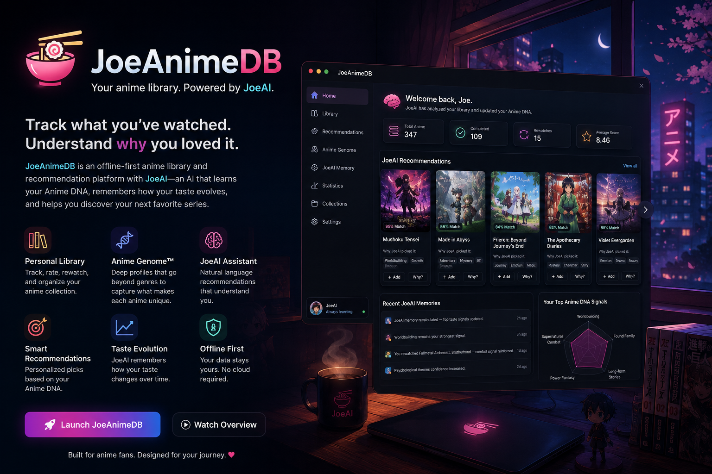

# 🍜 JoeAnimeDB

> Your personal, offline-first anime library—powered by JoeAI, Anime DNA, and Anime Genome cards.

[](https://github.com/WickedWampa/JoeAnimeDB/releases)


<p align="center">
  
</p>

JoeAnimeDB is a local Windows desktop application for tracking anime, exploring new shows, and understanding what makes your favorites work for you.

Traditional anime trackers remember **what** you watched. JoeAnimeDB also learns **why** you loved it.

Your ratings, rewatches, favorites, viewing history, recommendation feedback, Anime DNA, and Genome signals work together to make JoeAI increasingly personal—without requiring a cloud account or subscription.

> **Beta notice:** JoeAnimeDB 5.0 is currently in public beta. Back up your library before installing a new beta build.

## What’s new in v5.0

- First-time onboarding with guided library setup
- Smarter JoeAI intent routing, known-title answers, and explainable recommendations
- Anime Genome coverage with Gold, Enhanced, Core, and generated cards
- Kitsu-powered Discover catalog, current-season feeds, and upcoming releases
- Persistent recommendation feedback and JoeAI learning
- Redesigned Library, Favorites, Discover, Following, Upcoming, Settings, and About / Help pages
- Previous and next navigation inside the anime detail card
- Metadata review indicators and safer metadata refreshes
- Full backup and restore, CSV export, ranked-list export, and text-list import
- Built-in Windows update checks, download progress, and restart-to-install
- Six complete visual themes

## Core features

| Area | What it does |
| --- | --- |
| **Dashboard** | Summarizes your library, ratings, Anime DNA, recent activity, and rotating Pick of the Day. |
| **JoeAI** | Answers questions about known titles, explains recommendations, analyzes taste, and adds one or many anime to your library. |
| **Library** | Searches, sorts, filters, scores, edits, refreshes, and manages your personal anime collection. |
| **Favorites** | Gives your most important anime a dedicated Hall of Fame. |
| **Discover** | Ranks unseen Kitsu catalog titles using Anime DNA, Genome evidence, saved feedback, and the current request. |
| **Following** | Tracks anime you want to monitor while preserving Kitsu identity across updates. |
| **Upcoming** | Separates airing, upcoming, delayed, and date-TBA titles with cached fallback support. |
| **Analytics** | Turns ratings, genres, studios, rewatches, and viewing patterns into a readable taste profile. |
| **Settings** | Manages themes, imports, exports, backups, metadata repairs, Genome coverage, and JoeAI learning. |
| **About / Help** | Shows version details, app updates, provider status, storage locations, troubleshooting shortcuts, and release notes. |

## JoeAI

JoeAI is the application’s local anime assistant and recommendation layer. It combines your library with Anime DNA, Genome cards, catalog metadata, recommendation history, and explicit feedback.

Try questions such as:

```text
What is Dragon Ball?
Why do you recommend One Piece Fan Letter?
Recommend something like Slime, but darker.
What should I watch next?
Why do I like Bleach?
What are my strongest Anime DNA signals?
Add Trigun and Cowboy Bebop as Completed.
```

JoeAI distinguishes between:

- Direct questions about known anime
- Recommendation requests
- Similarity and mood requests
- Library commands
- Bulk-add commands
- Anime DNA and personal-statistics questions
- Unknown titles and temporarily unavailable metadata

Recommendations include the evidence behind each pick instead of returning an unexplained list.

## Anime Genome and Anime DNA

Genres alone cannot describe why two shows feel similar. JoeAnimeDB’s Genome system adds structured signals such as:

- Core fantasy and viewer fantasy
- Emotional profile and atmosphere
- Character and relationship dynamics
- Narrative rewards
- Signature themes and traits
- Accessibility and rewatch value
- Franchise and sequel identity

Genome cards can be curated or generated at several coverage levels:

- **Gold** — deeply curated anchor titles
- **Enhanced** — hand-developed genre and franchise coverage
- **Core** — broader expert coverage
- **Generated** — local first-pass cards created by the Genome updater

Anime DNA is your personal taste profile. It weighs Genome evidence alongside your ratings, rewatches, favorites, studios, genres, watch statuses, and recommendation feedback.

## Adding and importing anime

JoeAnimeDB supports several ways to build a library:

### Add from the Library

Choose **+ Add Anime** to search for one exact title or use Bulk Paste for several titles. Candidate selection helps prevent alternate-title and franchise mismatches.

### Add through JoeAI

JoeAI understands both individual and comma-separated bulk commands:

```text
Add Fullmetal Alchemist: Brotherhood as Completed.
Add Bleach, Naruto, One Piece, and Dragon Ball Z as Completed.
```

JoeAI confirms bulk commands, skips duplicates, and fetches metadata only where needed.

### Import a saved list

Open **Settings → Library → Import Library List**.

Supported formats include:

- JoeAnimeDB CSV exports
- Plain-text title lists
- Ranked text lists

Available scores and watch statuses are preserved when the source includes them. Existing titles are skipped, uncertain matches are placed in **Needs Review**, and a final metadata pass fills missing fields when possible.

### Back up or move the complete database

Use **Export Full Backup** before major updates or when moving to another computer. A full JSON backup contains the library, recommendation catalog, following state, JoeAI learning, and supported preferences.

Restoring a full backup replaces the active database, so JoeAnimeDB creates a safety backup first.

## Metadata providers

JoeAnimeDB uses:

- [Kitsu](https://kitsu.io/) for primary anime titles, artwork, synopsis, categories, community scores, studios, and release data
- [Wikidata](https://www.wikidata.org/) for confidence-checked completion of missing fields

The application preserves existing personal data during metadata refreshes, including your score, status, notes, favorites, rewatches, and following choices.

Live metadata requires an internet connection. Your saved library, cached catalog, and available cached release information remain usable offline.

JoeAnimeDB is an independent project and is not affiliated with Kitsu or the Wikimedia Foundation.

## Themes

The entire application follows the selected theme, including page art and the database updater:

- ⚡ Neon Signal
- 🌸 Sakura Bloom
- 💿 Vapor Wave
- 🍜 Ramen Mode
- 🔥 Inferno Drive
- ◉ AMOLED Black

Change themes from **Settings → Appearance**.

## Download and install

1. Open the [JoeAnimeDB releases page](https://github.com/WickedWampa/JoeAnimeDB/releases).
2. Download the latest Windows installer.
3. Run the installer and follow the setup prompts.
4. Complete the first-time tutorial or import an existing list or backup.

JoeAnimeDB is not currently code-signed. Windows SmartScreen may show an **Unknown publisher** warning. If you trust the downloaded release, choose **More info → Run anyway**.

## Local data and privacy

JoeAnimeDB is offline-first:

- No JoeAnimeDB account is required
- No subscription is required
- Your SQLite database is stored in your Windows user profile
- Full backups can be exported whenever you choose
- Uninstalling the application does not automatically delete the personal database
- Application updates replace program files without replacing your personal database

Use **About / Help → Open Data Folder** to locate the active database, or **Open Backups Folder** to view safety backups.

Before resetting the application, changing computers, or installing experimental builds, export a full backup from **Settings → Library**.

## Development

### Requirements

- Windows 10 or newer
- A current Node.js LTS release
- npm

### Run from source

```bash
git clone https://github.com/WickedWampa/JoeAnimeDB.git
cd JoeAnimeDB
npm install
npm run dev
```

Useful commands:

```bash
npm run web            # Vite browser development server
npm run desktop        # Start Electron while the Vite server is already running
npm run build          # Production frontend build
npm run pack:win       # Build the Windows NSIS installer
npm run pack:portable  # Build a portable Windows executable
npm run pack:dir       # Build an unpacked desktop directory
npm run release:win    # Build and publish the Windows updater artifacts
```

The packaged output is written to `dist-desktop`.

## Architecture

- **Electron** — Windows desktop shell, filesystem access, updater process, and IPC
- **electron-updater** — GitHub release checks, verified downloads, and NSIS installation
- **React + Vite** — interface and application state
- **better-sqlite3** — local library, catalog, following state, and JoeAI persistence
- **JoeAI Router** — intent classification and direct-question routing
- **Recommendation Coordinator** — combines request intent, taste, Genome signals, and feedback
- **Anime Genome Registry** — curated and generated title knowledge
- **Kitsu provider** — search, discovery, artwork, and release metadata
- **Wikidata resolver** — guarded missing-field repair

## Troubleshooting

### Metadata provider shows unavailable

Open **About / Help** or **Settings** and run the provider check again. Saved data remains available during a provider outage. Discover and Upcoming use cached results when possible.

### A title has the wrong metadata

Open its detail card and use the metadata refresh or review controls. Personal scores, notes, status, favorites, and rewatches are preserved.

### The application will not start after installing dependencies

Run:

```bash
npm install
npm run dev
```

If the native SQLite module reports an Electron compatibility error, reinstall dependencies from the project root before starting again.

### Find the database or backups

Use the buttons in **About / Help**. They open the exact folders used by the current installation.

## Beta status and known limitations

- Windows SmartScreen may warn because the application is unsigned.
- Provider outages can temporarily limit new metadata, Discover feeds, and release updates.
- Generated Genome cards are first-pass analysis and may be less detailed than curated Gold or Enhanced cards.
- Ambiguous franchise, sequel, and alternate-title matches may still require manual review.
- This beta is intended for testing; export a full backup before upgrading.

## Feedback

Please report crashes, interface bugs, recommendation problems, metadata mismatches, import issues, and installer problems through [GitHub Issues](https://github.com/WickedWampa/JoeAnimeDB/issues).

Helpful reports include:

- What you were trying to do
- The title involved
- What you expected
- What happened instead
- A screenshot or copied error message
- Whether Kitsu and Wikidata showed online

## Roadmap and release notes

- [v5 improvement backlog](./5.0%20Improvements/README.md)
- [Windows update release guide](./AUTO_UPDATE_RELEASE_GUIDE.md)
- [Release notes](https://github.com/WickedWampa/JoeAnimeDB/releases)

---

Most anime trackers remember **what** you watched.

JoeAnimeDB remembers **why** you loved it.
